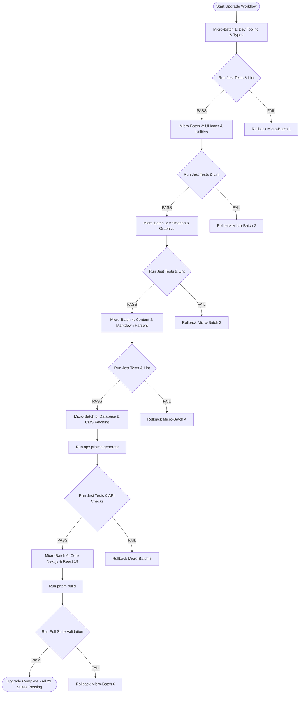

# Package & Dependency Safe Upgrade Plan

> **KMS Tech Next Platform (`kmstech-next`)**  
> *Architected for Next.js 16, React 19, Prisma 6, and TypeScript 5*

This document provides a bulletproof, non-breaking execution plan to upgrade all project dependencies safely across **6 isolated micro-batches** with automated test verification gates after each step.

---

## 🎯 Non-Breaking Micro-Batch Strategy



---

## 📦 Micro-Batch Breakdown

### Micro-Batch 1: Developer Tooling & Types (Zero Runtime Risk)
- **Packages**: `@types/node`, `@types/react`, `@types/react-dom`, `@types/jest`, `@types/sanitize-html`, `@types/snazzy-info-window`, `eslint`, `husky`, `tsx`
- **Verification Gate**: `npx jest --watchAll=false` & `pnpm lint`

### Micro-Batch 2: UI Icons & Utility Libraries (Low Risk)
- **Packages**: `lucide-react`, `react-icons`, `date-fns`, `@vercel/analytics`
- **Verification Gate**: `npx jest --watchAll=false` (Tests: `Contact`, `Services`, `WorkflowStep`, `BlogCard`)

### Micro-Batch 3: Graphics & Animation Engines (Low Risk)
- **Packages**: `gsap`, `@react-google-maps/api`, `snazzy-info-window`
- **Verification Gate**: `npx jest --watchAll=false` (Tests: `MainLogo`, `SVGLayer`, `TopQuote`, `TransitionLink`)

### Micro-Batch 4: Content Parsing & Markdown (Medium Risk)
- **Packages**: `react-markdown`, `react-syntax-highlighter`, `@types/react-syntax-highlighter`, `rehype-raw`, `remark-gfm`, `sanitize-html`
- **Verification Gate**: `npx jest --watchAll=false` (Tests: `BlogContent`, `CodeBlock`)

### Micro-Batch 5: Database & CMS Fetching (Medium Risk)
- **Packages**: `@prisma/client`, `prisma`, `swr`, `graphql-request`, `graphql`
- **Action**: Run `npx prisma generate` immediately post-install.
- **Verification Gate**: `npx jest --watchAll=false` (Tests: `useViewCounter`, `ViewCountLabel`)

### Micro-Batch 6: Core Framework Alignment (High Risk)
- **Packages**: `next`, `eslint-config-next`, `@next/third-parties`, `react`, `react-dom`
- **Verification Gate**:
  1. `npx jest --watchAll=false`
  2. `pnpm build` (Production Webpack compilation test)

---

## ⏪ Rollback Protocol

If any micro-batch fails its verification gate, run:
```bash
git checkout package.json pnpm-lock.yaml && pnpm install
```
This instantly restores the exact pre-batch lockfile state.

---
*Maintained for safe dependency lifecycle management on the KMS Tech platform.*
